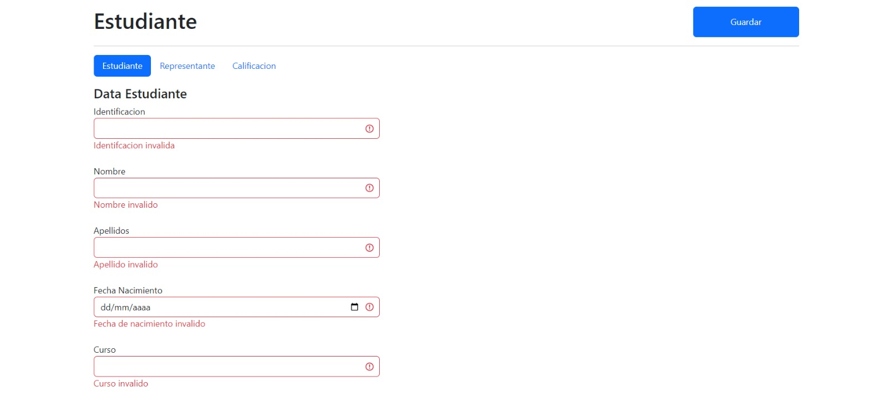
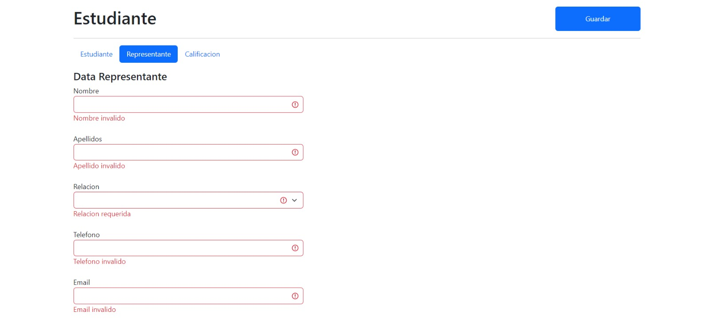
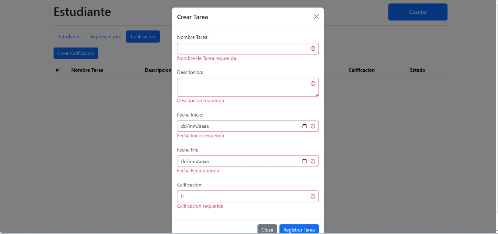
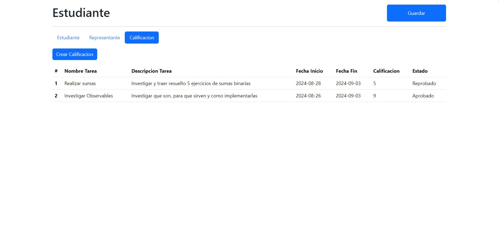
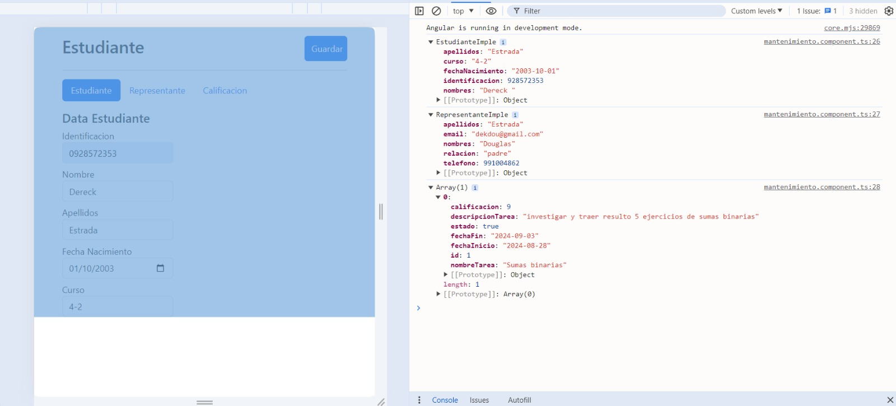

# Ejercicio2

This project was generated with [Angular CLI](https://github.com/angular/angular-cli) version 17.3.8.

## Development server

Run `ng serve` for a dev server. Navigate to `http://localhost:4200/`. The application will automatically reload if you change any of the source files.

## Code scaffolding

Run `ng generate component component-name` to generate a new component. You can also use `ng generate directive|pipe|service|class|guard|interface|enum|module`.

## Build

Run `ng build` to build the project. The build artifacts will be stored in the `dist/` directory.

## Running unit tests

Run `ng test` to execute the unit tests via [Karma](https://karma-runner.github.io).

## Running end-to-end tests

Run `ng e2e` to execute the end-to-end tests via a platform of your choice. To use this command, you need to first add a package that implements end-to-end testing capabilities.

## Further help

To get more help on the Angular CLI use `ng help` or go check out the [Angular CLI Overview and Command Reference](https://angular.io/cli) page.

## Definición Tarea
En la caperta models se encontra la interface y las clases usadas, el proyecto esta dividido en un modulo con tres 5 componentes en los que se ha trabajo, cada formulario esta valida mediante el reactiveForm, en el html se uso la sentencia if para mostrar el mensaje del error en caso de no poder mandar la data, usando tambien la clase is-invalid de bootstrap para ser mas especifico de cual es el campo invalido, para facilitar el acceso a dichos campos se uso el metodo getInvalidArgument() que recibe como parametro un string en el que se haria referencia el nombre del campo del formGroup, dentro del metodo se accede para ver si el campo es invalido y de serlo retornar un true.
En la tabla se uso el for para recorrer el arreglo, para el ingreso de tareas se uso otro componente con el modal de igual forma validado como se menciono anteriormente al momento de tener todos los campos requeridos llenos se oprime el boton de guardar y este hara emitir un evento que por alguna forma decirlo escuchara su contenedor que seria el de tablas de calificaciones para luego proceder insertarse en el array y ser mostrado, se creo un pipe que muestre al usuario "reprobado" o "aprobado" dependiendo de la nota ingresada.
Aunque no es necesario tener calificaciones o tareas registradas para usar el boton Guardar del componente mantenimiento igual se mostrara dicha informacion en consola, puesto que el boton de mantemiento accede a los metodos guardar() de cada componente mediante ViewChild  validando que los componentes de estudiante y presentante sean validos para que estos puedan emitir el evento y luego se haga los respectivos "set" a las variables de mantemiento finalizando con mostrar la data en la consola.

